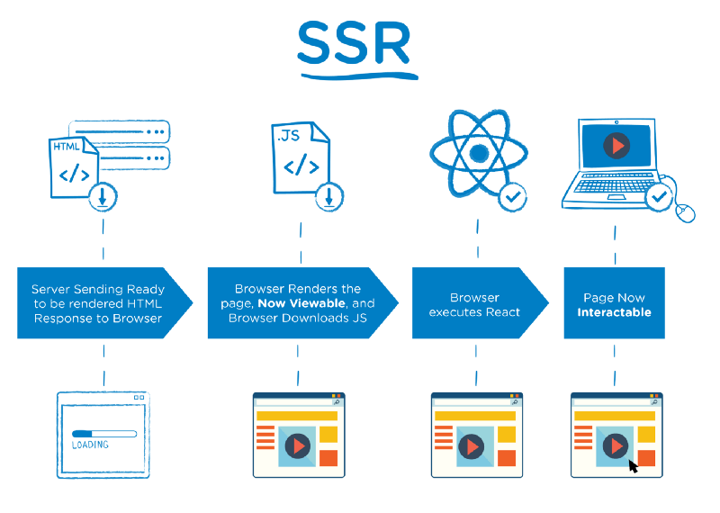
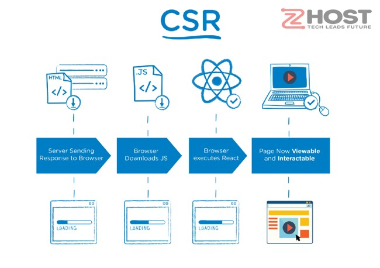

### Tài liệu Next

### File Based Routing

- Trong NextJS việc triển khai các routes giống hệt như một cấu trúc thư mục

```js
├── app
│   ├── restaurant
│   │   ├── [slug]
│   │   │    ├── page.tsx
│   │   │    ├── menu
│   │   │        ├── page.tsx
│   │   ├── page.tsx
│   ├── menu
│   ├── search
```

=> Để truy cập trang `restaurant` thì đường dẫn sẽ là `/restaurant`, để truy cập chi tiết của `restaurant` thì đường dẫn là `/restaurant/[dynamic_params]` (chính là trang `slug`), truy cập vào menu của slug đó sử dụng path: `/restaurant/[dynamic_params]/menu`

### Router

- Để biến một `server component` thành `client component` chúng ta có thể sử dụng `"use client"` ở đầu trang đó
- `useRouter` giúp di chuyển đến các đường dẫn tại `local`

### Naming convention

- Quy ước đặt tên trong NextJS: Đặt tên các thành phần có xu hướng giống nhau

### Server vs Client component

- `Server side rendering`:



    + Nội dung HTML được xử lý trên server và trả lại cho browser, lúc này nội dung HTML đã hoàn chỉnh và được hiển thị ngay khi nó được load về máy, tuy nhiên lúc này trang web mới chỉ xem được nội dung, người dùng chưa thể tương tác được. Ngay trong lúc này, trình duyệt vẫn âm thầm tải tiếp JS và thực thi nó ngay khi hoàn tất, một khi hoàn tất quá trình này người dùng mới có thể tương tác được. Nghĩa là mỗi lần đến một trang mới thì toàn bộ trang mới đó sẽ được re-render lại toàn bộ
    + Nhược điểm:
        + Chỉ cần một thay đổi nhỏ thôi cũng khiến trang web render lại toàn bộ
        + Việc xử lý HTML gây ra tốn tài nguyên server, gây chậm khi xử lý các request khác
        + Lượng request lên server nhiều, mọi tác vụ đều phải xử lý lại trên server và render lại HTML
        + TTFB (Time To First Byte) cao do cần phải xử lý trên server, sẽ ảnh hưởng tới một vài công cụ benchmark
    + Ưu điểm (Khiến nó chưa thể bị thay thế hoàn toàn):
        + Hỗ trợ rất mạnh bởi SEO bởi vì các Search engines của Google có thể Crawler dữ liệu tốt hơn
        + Load trang đầu tiên sẽ rất nhanh
        + Tuyệt vời đối với các trang static page

- `Client Side Rendering`:



    + Ta có thể nhận thấy trình duyệt sẽ load tất cả nội dung về máy, một khi đã load thành công, nó sẽ thực thi code, lúc này nội dung trang web mới được hiển thị ra.
    + Server bây giờ chỉ chịu trách nhiệm tải dữ liệu thô của trang web. Mọi thứ khác được xử lý bởi client-site Javascript library (Vuejs, React, Angular,...)
    + Nhược điểm:
        + Lượng dữ liệu lần đầu load về khá nặng
        + Nội dung hiển thị ra lần đầu chậm hơn so với SSR, tuy nhiên những lần sau thì quá nhanh do việc xử lý ngay trên client.
        + SEO bị ảnh hưởng, do nội dung web được sinh trên client, khiến crawler của của Seach engine không tiếp xúc được nội dung. Gần đây mới có Google giải quyết được vấn đề này, tuy nhiên dù Google nắm phần lớn thị phần tìm kiếm thì tại những quốc gia khác nhau, sẽ có ảnh hưởng nhất định.

=> `NextJS` kết hợp cả hai `SSR` và `CSR`. Trong NextJS, các `Server component` là mặc định và để nó là `Client component` thì chỉ cần sử dụng `use client` ở đầu file (Trong trường các hook như useEffect, useState, ... được sử dụng).

=> Lưu ý: Nên sử dụng các `Client components` ít nhất có thể

- `Server component` có thể hiển thị `Client component`, nhưng sau đó `Client component` không thể hiển thị `Server component`, tuy nhiên có một ngoại lệ: `Client component` có thể hiển thị `Server component` khi nó được truyền vào dưới dạng `children props`

- Các trường hợp sử dụng `Client component` hay `Server component`
  - `Client component`:
    - Khi tương tác và sử dụng các `evnent listeners` như: `onClick`, `onChange`
    - Khi sử dụng `State`, `Lifecycle Effects` (useState(), useReducer, useEffect, ...)
    - Khi sử dụng `browser-only APIS`
    - Khi sử dụng `custom hook` có phụ thuộc vào state, effects, browser only apis
    - Sử dụng React class components
  - `Server component`:
    - Fetch data
    - Truy cập trực tiếp vào resources backend
    - Giữ thông tin nhạy cảm trên máy chủ (tokens, api keys, ...)
    - Giữ các phụ thuộc lớn trên server / giảm thiếu client-side javascript

### Supabase (Giống như firebase, nó hỗ trợ Postgres database, Authentication, instant APIs, Edge Functions, Realtime subscriptions, and Storage...)

- Cài đặt supabase
- Cài đặt prisma

### Phân tích DB

- Restaurant table

  - id
  - name
  - main_img
  - description
  - images
  - open_time
  - close_time
  - slug
  - price
  - location_id (forigein key)
  - cuisine_id (forigein key)

- Item table

  - id
  - name
  - price
  - description
  - restaurant_id (forigein key)

- Location table

  - id
  - name

- Cuisine
  - id
  - name

=> Một nhà hàng có thể có nhiều món ăn, nhưng một món ăn sẽ chỉ có tại một nhà hàng => Mối quan hệ 1 - n, tương tự với các bảng còn lại

### How we fetch data in server components

- Nếu đang ở `client component` thì chúng ta có thể sử dụng `http request` để giao tiếp với server, tuy nhiên nếu là `Server component` (component này live in server) vì thế không sử dụng `http request` tới cùng một server, thay vào đó, những `server component` sẽ thao tác trực tiếp đến server bằng các `truy vấn sql`

### Fetch api from server component

- NextJs tự động sử dụng typescript
- Props mặc định sẽ được truyền vào trong một component (VD: `{params: anything, searchParam: anything}`). Tuy nhiên điều này chỉ được áp dụng đối với `page component` và không áp dụng đối với những `regular component`

### Định nghĩa thêm bảng Review và User

- Review

  - id
  - first_name
  - last_name
  - text
  - rating
  - restaurant_id
  - user_id
  - created_at
  - update_at

- User

  - id
  - first_name
  - last_name
  - city
  - email
  - phone
  - created_at
  - updated_at

- update db cli: `npx prisma db push`

### Introduction to Loading State

- Khi một web app được render với `server side` lúc này client sẽ gửi request tới server lấy toàn bộ html và thông tin cần thiết (Điều này đôi khi gây ra chậm) => Cần add thêm loading

- thẻ `<Link>` có thể được dùng để handle các params, query phức tạp

### Authentication

- `salt` là gì?

  - salt là một phương pháp bảo mật bổ sung, nó lấy mật khẩu và thêm một loại các kí tự vào bên trái hoặc phải trước khi băm nó
  - `const hashPassword = await bcrypt.hash(password, 10)` thêm 10 kí tự vào bên phải mật khẩu trước khi thực hiện hash

- `jwt` bao gồm có 3 phần: header, payload và singnature

  - `payload`: chứa thông tin định danh người dùng gửi request

- Cài đặt `npm i jose` để tạo mã json web token cho những web sử dụng cơ chế `server side rendering`
- Lý do không sử dụng `jsonwebtoken` từ đầu là do thư viện này có một số vấn đề về web server side rendering

- Trong `server component` chúng ta không thể sử dụng `useContext`
- Sử dụng `npx prisma studio` để xem các tables DB trên browser

### Understanding Many to many relationships

- Booking

  - id
  - number_of_people
  - booking_time
  - booker_email
  - booker_phone
  - booker_first_name
  - booker_last_name
  - booker_occassion (dịp đặt phòng)
  - booker_request

- Table
  - id
  - seats

=> Mối quan hệ giữa Booking và Restaurant là 1-N, của Table với Restaurant là 1-N, ngoài ra còn có mối quan hệ 1-N giữa Table với Booking (Có nhiều booking trên một table (Thời gian đặt khác nhau) nhưng 1 booking sẽ chỉ thuộc 1 cái table) => Điều này là sai nếu như một bàn chỉ có 4 chỗ ngồi nhưng người booking lại đặt 8 chỗ => Họ cần gộp 2 bàn 4 chỗ lại với nhau => Quan hệ giữa Table với booking không thể là mối quan hệ 1-N, nó là quan hệ M-N

=> Để thiết kế cơ sở dữ liệu cho quan hệ M-N chúng ta không thể sử dụng một field mới (VD booking_id, table_id) được. vì một field không thể chứa nhiều giá trị ids => Thay vào đó chúng ta sử dụng một bảng mới: Như sau:

- Booking_table
  - id
  - booking_id
  - table_id
